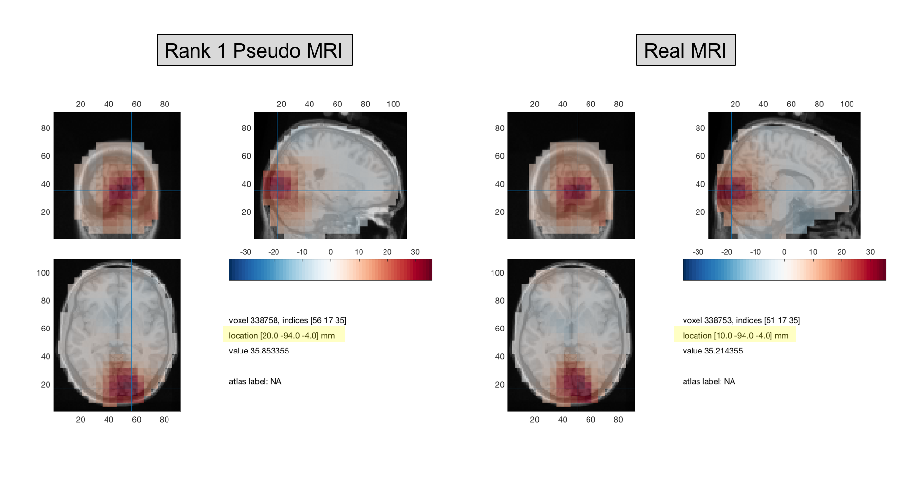

# MEMES
**MRI Estimation for MEG Sourcespace (MEMES)** is a set of tools for estimating an appropriate structural MRI for MEG source analysis in Fieldtrip and/or SPM.

### WORK IN PROGRESS
Use these scripts at your own risk

### Citation
If you use MEMES or any of the scripts in this repository, we ask you to please cite the DOI link below:

```MATLAB 
Robert Seymour. (2018, October 8). 
Macquarie-MEG-Research/MEMES: For Zenodo (Version v0.31). 
Zenodo. 
http://doi.org/10.5281/zenodo.1451031
```
[](https://zenodo.org/badge/latestdoi/117603642)

The scripts presented in this repository are customised for data acquired from the Wellcome Centre for Human Neuroimaging, OPM lab.

### Outline

MEMES is based on the approach of [Gohel et al., (2017)](https://www.frontiersin.org/articles/10.3389/fninf.2017.00050/full). It uses an Iterative Closest Point (ICP) algorithm to match participant's headshape information to a database of template MRIs. The best matching MRI is chosen for subsequent source analysis.


MEMES produces a coregistered MRI for subsequent source analysis in Fieldtrip.

**Please note:** MEMES and ICP work best with some facial information alongisde the headshape information

### MRI Databases

Template MRIs can be obtained from:
- [Human Connectome Project (HCP)](https://db.humanconnectome.org) MEG data (95 participants)

- [Neurodevelopmental MRI Database](http://jerlab.psych.sc.edu/NeurodevelopmentalMRIDatabase/) with templates from 18 months - adult (copyright John Richards, USC)

Please refer to the [/create_library folder](./create_library) for more information regarding the organisation of MRI libraries.

### MEMES for participants aged 18+

For participants aged 18+, please use MEMES_FIL.m in conjunction with an appropriate MRI database. You will need to create a series of meshes, headmodels and sourcemodels yourself. Alternatovely you can request a ready-made library from [@neurofractal](http://neurofractal.github.com). Please refer to the [/create_library folder](./create_library) for more information.

```MATLAB 
%
%%%%%%%%%%%%%%%%%%%%%%%%%%%%%%%%%%%%%%%%%%%%%%%%%%%%%%%%%%%%%%%%%%%%%%%%%%%%%%%%%%%
% MRI Estimation for MEG Sourcespace (MEMES)
%
%%%%%%%%%%%
% Inputs:
%%%%%%%%%%%
%
% - dir_name              = directory for saving
% - grad_trans            = MEG sensors realigned based on elp/mrk files
% - headshape_downsampled = headshape downsampled to 100-200 scalp points
% - path_to_MRI_library   = path to HCP MRI library
% - method                = method for creating pseudo head- and
%                           source-model: 'best' or 'average' 
% 							over first 20 best-fitting MRIs). Testing is still 
% 							ongoing, so if unsure use 'best' for now.
% - scaling               = scaling factor range applied to MRIs
%
%%%%%%%%%%%%%%%%%%
% Variable Inputs:
%%%%%%%%%%%%%%%%%%
%
% - sourcemodel_size      = size of sourcemodel grid (5,8 or 10mm)
% - weight_face           = how much do you want to weight towards the  
%                           facial information (1 = no weighting;  
%                           10 = very high weighting. RS recommends 
%                           weight_face = 3;
%
%%%%%%%%%%%
% Outputs:
%%%%%%%%%%%
%
% - grad_trans              = sensors transformed to correct
% - shape                   = headshape and fiducial information
% - headshape_downsampled   = headshape downsampled to 100 points
% - trans_matrix            = transformation matrix applied to headmodel
%                           and sourcemodel
% - sourcemodel3d           = sourcemodel warped to MNI space
% - headmodel               = singleshell headmodel (10000 vertices)
%
```



### Child MEMES (for participants aged <18)

Use child_MEMES/child_MEMES.m in conjunction with a database of meshes, headmodels and sourcemodels from the [Neurodevelopmental MRI Database](http://jerlab.psych.sc.edu/NeurodevelopmentalMRIDatabase/)

```MATLAB 
%%%%%%%%%%%%%%%%%%%%%%%%%%%%%%%%%%%%%%%%%%%%%%%%%%%%%%%%%%%%%%%%%%%%%%%%%%%%%%%%%
% MRI Estimation for MEG Sourcespace (MEMES) cutomised for child MEG.
%
% Written by Robert Seymour (Macquarie Univ Dept of Cognitive Science, 2018
% - 2019). robert.seymour@mq.edu.au
%
%%%%%%%%%%%
% Inputs:
%%%%%%%%%%%
%
% - dir_name              = directory for saving
% - grad_trans            = MEG sensors realigned based on elp/mrk files
% - headshape_downsampled = headshape downsampled to 100-200 scalp points
% - path_to_MRI_library   = path to custom child MRI library
%
%%%%%%%%%%%%%%%%%%
% Variable Inputs:
%%%%%%%%%%%%%%%%%%
%
% - weight_face           = how much do you want to weight towards the  
%                           facial information (1 = no weighting;  
%                           10 = very high weighting. RS recommends 
%                           weight_face = 3;
%%%%%%%%%%%
% Outputs:
%%%%%%%%%%%
%
% - sourcemodel3d           = 8mm sourcemodel warped to MNI space
% - headmodel               = singleshell headmodel (10000 vertices)
% - MEMES_output            = info about the coreg, including which MRI was
%                           selected and 2 transformation matrices
%
```

### How Well Does MEMES work?

Good question! 

Robert [(@neurofractal)](https://github.com/neurofractal) has done some investigation into this, for adult data

#### Validation #1: Does MEMES produce sensible results?

We analysed 3 datasets in which participants viewed a static visual grating vs baseline. This produces an increase in gamma (40-80Hz) power. Using MEMES followed by a beamformer, the visual gamma response was localised across these 3 datasets. Results show a very clear occipital increase in power, characteristic of the visual gamma response. 


So answer = YES!

#### Validation #2: How well does MEMES perform vs True MRIs?

For this visual gamma data, real subject specific MRIs were also acquired. These source results are treated as the 'ground truth'.

Various options were applied to MEMES computation including:

- Standard MEMES (no special options)
- Averaging the sourcemodel/headmodel over the best 20 MRIs, rather than taking the best fitting (found to improve the results in Gohel et al., 2017)
- Scaling the MRI sourcemodels up/down by 1-2% to find the best size for each member of the MRI database
- Excluding the facial information

Comparing the distance between sourcemodels created from the real and psedo MRI shows that for most options the errors are only 1-2cm. The 'No Face' condition seems to produce a few more errors than the other options.


Comparing the distance between the peak visual gamma response of the real and psedo MRI shows that for most options the errors are only 1-2cm.


Comparing the difference in visual gamma power between the real and psedo MRI shows that for all options, there were very changes.


## License:

CC BY-NC: This license allows reusers to distribute, remix, adapt, and build upon the material in any medium or format for noncommercial purposes only, and only so long as attribution is given to the creator. 

It includes the following elements:

BY  – Credit must be given to the creator
NC  – Only noncommercial uses of the work are permitted
